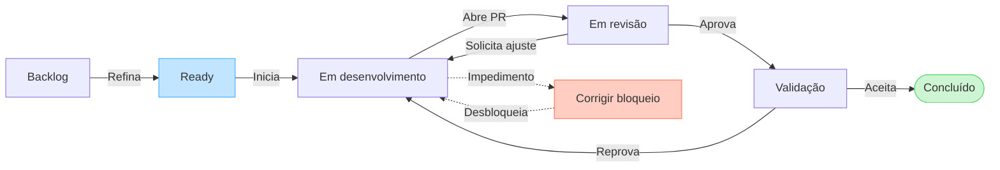
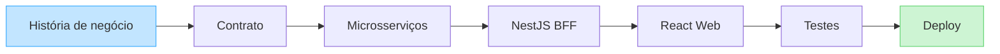

# Guia de desenvolvimento ágil

## 1. Objetivo

Este documento define como a PoC será conduzida. O modelo procura reduzir trabalho em andamento, entregar funcionalidades demonstráveis cedo e manter ciclos curtos de feedback.

A abordagem escolhida é **Kanban com entregas verticais**, branches curtas e integração contínua. Cerimônias de Scrum não serão simuladas quando não houver equipe ou necessidade real.

## 2. Fluxo de trabalho



### Políticas do quadro

- Cada pessoa mantém no máximo uma tarefa em **Em desenvolvimento**.
- Uma tarefa só entra em **Ready** quando satisfaz a Definition of Ready.
- **Em revisão** significa que a mudança está publicada em uma pull request e o CI obrigatório passou.
- **Validação** confirma os critérios de aceite no ambiente integrado.
- Tarefas bloqueadas permanecem visíveis, com causa, responsável pelo próximo passo e data da próxima verificação.
- Bugs críticos podem interromper o fluxo; demais bugs entram no backlog e são priorizados normalmente.

## 3. Fatias verticais

O trabalho será dividido por capacidade de negócio, atravessando as camadas necessárias.

Exemplo recomendado:



Não é recomendado construir todo o backend antes do front-end. Cada fatia deve produzir algo integrado, testável e demonstrável.

### Tamanho esperado

- uma tarefa deve ser concluída, em condições normais, em um ou dois dias de trabalho;
- tarefas maiores devem ser quebradas por comportamento, não apenas por camada técnica;
- mudanças estruturais podem existir como enablers, mas precisam indicar qual entrega de negócio habilitam.

## 4. Definition of Ready

Uma tarefa está pronta para desenvolvimento quando possui:

- problema ou resultado esperado claramente descrito;
- critérios de aceite observáveis;
- dependências e riscos conhecidos;
- estados de carregamento, vazio, sucesso e erro considerados, quando aplicáveis;
- comportamento responsivo e acessível definido;
- contrato HTTP preliminar, quando houver integração;
- tamanho compatível com uma entrega curta;
- nenhuma decisão essencial pendente que possa invalidar a implementação.

## 5. Definition of Done

Uma tarefa está concluída quando:

- critérios de aceite foram validados;
- código compila e passa por lint e formatação;
- testes proporcionais ao risco foram adicionados e estão verdes;
- revisão de código foi concluída;
- pipeline obrigatório está verde;
- interface foi verificada em viewport móvel e desktop;
- fluxo funciona por teclado e não introduz violações críticas de acessibilidade;
- OpenAPI, ADRs e demais documentos afetados foram atualizados;
- não existem pendências críticas escondidas em comentários;
- a funcionalidade pode ser demonstrada no ambiente integrado.

## 6. Estratégia Git

Será utilizado um fluxo trunk-based simplificado:

- `main` deve permanecer estável e protegida;
- branches têm vida curta e seguem nomes como `feat/order-filters` ou `fix/status-transition`;
- commits são pequenos, intencionais e seguem Conventional Commits;
- pull requests devem representar uma única mudança coerente;
- integração será feita preferencialmente por squash merge;
- feature flags podem proteger funcionalidades incompletas que precisem ser integradas cedo;
- mudanças não relacionadas não devem ser agrupadas na mesma pull request.

### Exemplos de commits

```text
feat(web): add order status filters
feat(api): validate order status transition
test(bff): cover upstream timeout mapping
docs: record frontend state strategy
```

## 7. Pull requests e revisão

Toda pull request deve informar:

- problema resolvido;
- solução adotada;
- instruções de validação;
- testes adicionados ou justificativa para sua ausência;
- screenshots ou vídeo quando houver mudança visual;
- impactos de acessibilidade, performance ou contrato;
- riscos, concessões e decisões relevantes.

Pull requests pequenas tendem a receber revisões melhores. Aproximadamente 400 linhas relevantes é um sinal para avaliar divisão, não um limite rígido. Arquivos gerados, migrations e snapshots devem ser avaliados separadamente desse indicador.

### Checklist do revisor

- A implementação atende aos critérios sem ampliar desnecessariamente o escopo?
- As responsabilidades estão na camada correta?
- Há tratamento para falhas e dados inesperados?
- Os testes verificam comportamento público, não detalhes internos?
- Nomes, contratos e mensagens são compreensíveis?
- A mudança preserva segurança, acessibilidade e performance?

## 8. Automação e feedback rápido

### Antes do commit

- formatação;
- lint dos arquivos afetados;
- verificação de tipos;
- testes relacionados à mudança.

### Em pull requests

- lint e verificação de tipos;
- testes unitários e de componentes;
- testes de integração;
- build das aplicações;
- validação de migrations e contratos;
- Playwright para o fluxo crítico, conforme a suíte amadurecer.

Evidências de falha, como logs, screenshots e traces do Playwright, devem ser armazenadas pelo CI. O pipeline deve favorecer feedback rápido sem ocultar falhas por uso incorreto de cache.

## 9. Ciclo de planejamento e feedback

Para uma pessoa ou equipe pequena:

- planejamento semanal de 20 a 30 minutos;
- atualização diária assíncrona com feito, próximo passo e bloqueios;
- demonstração ao final de cada fatia vertical;
- refinamento semanal do backlog;
- retrospectiva curta ao final de cada fase;
- revisão de arquitetura somente quando uma decisão relevante surgir.

Uma retrospectiva deve terminar com no máximo uma ou duas ações verificáveis. Ações sem responsável ou data de revisão não serão consideradas acordos.

## 10. Decisões arquiteturais

Decisões com impacto duradouro serão registradas como Architecture Decision Records em `docs/adr/`:

```text
Contexto
Decisão
Alternativas consideradas
Consequências
Status
```

Exemplos previstos:

- NestJS como BFF;
- TanStack Query e Zustand com responsabilidades distintas;
- quantidade mínima de microsserviços com fronteiras explícitas;
- OpenAPI como fonte dos contratos HTTP.

O ADR registra a razão da decisão no momento em que foi tomada. Ele não deve virar documentação duplicada da implementação.

## 11. Métricas de fluxo e qualidade

Serão acompanhadas poucas métricas acionáveis:

| Métrica | Uso |
|---|---|
| Lead time | medir tempo de `Ready` até `Concluído` |
| Cycle time | medir tempo de desenvolvimento ativo |
| Trabalho bloqueado | identificar dependências e gargalos |
| Tempo de revisão | detectar pull requests grandes ou falta de disponibilidade |
| Taxa de falha do CI | melhorar confiabilidade e velocidade do pipeline |
| Defeitos após conclusão | avaliar qualidade dos critérios e testes |

As métricas servem para melhorar o sistema de trabalho, não para comparar produtividade individual. Cobertura de testes também não será tratada isoladamente como indicador de qualidade.

## 12. Gestão do backlog

As prioridades seguem esta ordem:

1. corrigir problema que impede a jornada principal;
2. concluir trabalho já iniciado;
3. entregar a próxima fatia vertical do MVP;
4. reduzir risco técnico que bloqueia entregas próximas;
5. melhorias e experimentos fora do MVP.

Itens fora do MVP permanecem documentados, mas não entram em **Ready** enquanto ameaçarem a conclusão e o polimento da jornada principal.

## 13. Acordos para a PoC

- qualidade é construída durante a tarefa, não adicionada em uma fase final;
- a demonstração integrada vale mais do que progresso isolado por camada;
- documentação deve explicar decisões e operação, não repetir o código;
- toda exceção consciente à Definition of Done deve ficar explícita no backlog;
- primeiro será concluído um fluxo ponta a ponta; depois serão ampliadas cobertura e sofisticação.
