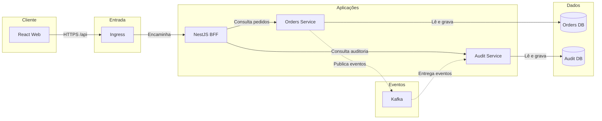

# Arquitetura e decisões

## Visão geral



No ambiente local, os componentes serão executados por Docker Compose. No ambiente remoto, web, BFF e API serão empacotados em containers e executados no Kubernetes por meio do Amazon EKS; o PostgreSQL será fornecido pelo Amazon RDS. Consulte [Infraestrutura, AWS e ambientes](INFRASTRUCTURE.md).

## Responsabilidades

### React Web

- renderização e interação;
- roteamento e filtros na URL;
- cache de dados remotos e feedback de mutations;
- responsividade, acessibilidade e estados visuais;
- nenhuma regra autoritativa de transição de pedido.

### NestJS BFF

- contrato otimizado para a interface;
- composição de resumo e pedidos recentes no dashboard;
- tradução de parâmetros e DTOs;
- timeout, normalização de erros e propagação de correlação;
- nenhuma persistência própria no MVP.

As responsabilidades, os limites e os exemplos de contrato estão detalhados em [Backend for Frontend](BFF.md).

### Spring Boot Services

- Orders Service: modelo, casos de uso, consultas e transições de pedidos;
- Audit Service: registro e consulta da auditoria operacional;
- Kafka: transporte assíncrono dos eventos de pedidos;
- persistência e migrations pertencem ao serviço responsável;
- contratos REST permanecem orientados ao domínio de cada serviço.

## Estrutura prevista do monorepo

```text
.
├── apps/
│   ├── web/            # React + TypeScript
│   └── bff/            # NestJS
├── microservices/
│   ├── orders-service/ # Java + Spring Boot
│   └── audit-service/  # Java + Spring Boot
├── contracts/
│   └── events/         # schemas versionados dos eventos Kafka
├── packages/
│   ├── api-contracts/  # tipos gerados/compartilhados onde fizer sentido
│   └── config/         # configuração comum de tooling JS
├── docs/
├── e2e/                # Playwright
├── infra/
│   ├── helm/           # chart Kubernetes
│   └── terraform/      # infraestrutura AWS
├── compose.yaml
└── .github/workflows/
```

## Modelo inicial

### Order

- `id`: UUID;
- `number`: identificador amigável;
- `customerName`;
- `totalAmount` e `currency`;
- `status`: `PENDING`, `APPROVED`, `PROCESSING`, `SHIPPED`, `CANCELLED`;
- `createdAt`, `updatedAt`;
- coleção de itens;
- histórico de transições.

### Transições propostas

```text
PENDING -> APPROVED -> PROCESSING -> SHIPPED
    |          |            |
    +----------+------------+-> CANCELLED
```

Pedido enviado não pode ser cancelado. Uma transição inválida retorna HTTP 409 com erro de domínio identificável.

## Contratos REST iniciais

### BFF consumido pelo browser

- `GET /api/dashboard`
- `GET /api/orders?q=&status=&from=&to=&page=&size=&sort=`
- `GET /api/orders/{id}`
- `PATCH /api/orders/{id}/status`

### API de domínio consumida pelo BFF

- `GET /orders`
- `GET /orders/{id}`
- `GET /orders/summary`
- `PATCH /orders/{id}/status`

### Erro padronizado

```json
{
  "type": "INVALID_STATUS_TRANSITION",
  "title": "Não foi possível alterar o status",
  "status": 409,
  "detail": "A transição solicitada não é permitida.",
  "correlationId": "uuid"
}
```

O formato será inspirado em Problem Details, sem acoplar a interface a mensagens internas.

## Estratégia de testes

```text
Poucos testes E2E: jornada crítica completa
Alguns testes de integração: HTTP, banco e contratos
Muitos testes focados: regras, hooks e componentes
```

- Web: componentes consultados por papel/nome acessível e MSW para fronteira HTTP.
- BFF: services isolados e controllers com Supertest.
- Spring: regras sem infraestrutura, slices quando úteis e Testcontainers para persistência.
- E2E: listar, filtrar, abrir detalhe e alterar status.

## Decisões arquiteturais iniciais

### ADR-001 — NestJS como BFF real

O BFF existe para entregar contratos orientados às telas e compor o dashboard. Ele não será apenas um proxy e tampouco será dono das regras do domínio.

### ADR-002 — Poucos microsserviços com fronteiras explícitas

A PoC começará com Orders Service e Audit Service. Cada serviço terá responsabilidade e dados próprios; novos serviços não serão criados sem uma fronteira de negócio clara.

### ADR-003 — Três tipos de estado no front-end

- URL: filtros e paginação compartilháveis;
- TanStack Query: estado remoto;
- Zustand: estado transversal exclusivamente de interface.

Essa separação evita um store global que replique dados do servidor.

### ADR-004 — Contrato documentado e geração seletiva

OpenAPI será a fonte do contrato HTTP. Tipos poderão ser gerados para reduzir divergência, mas modelos internos de domínio não serão compartilhados entre Java e TypeScript.

### ADR-005 — Kafka desde a primeira fatia

Orders Service publicará eventos por transactional outbox e Audit Service será consumidor idempotente. Consulte [ADR-0002](adr/0002-kafka-in-first-vertical-slice.md).

## Evoluções possíveis, fora do MVP

- extrair notificações ou auditoria como serviço independente;
- autenticação OIDC;
- ampliar os eventos assíncronos e adotar schema registry quando necessário;
- observabilidade distribuída com OpenTelemetry;
- deploy automatizado e ambientes efêmeros.

## Estratégias complementares

- [Infraestrutura, AWS e ambientes](INFRASTRUCTURE.md)
- [Testes e CI/CD](TESTING-CICD.md)
- [ADR-0001 — Walking skeleton integrado](adr/0001-integration-first-walking-skeleton.md)
- [ADR-0002 — Kafka na primeira fatia](adr/0002-kafka-in-first-vertical-slice.md)
