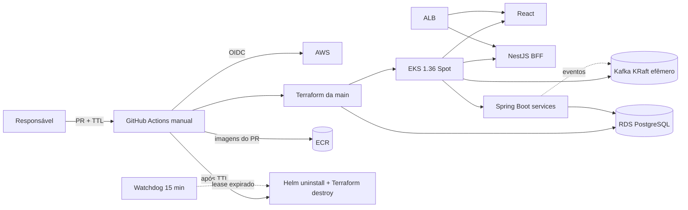
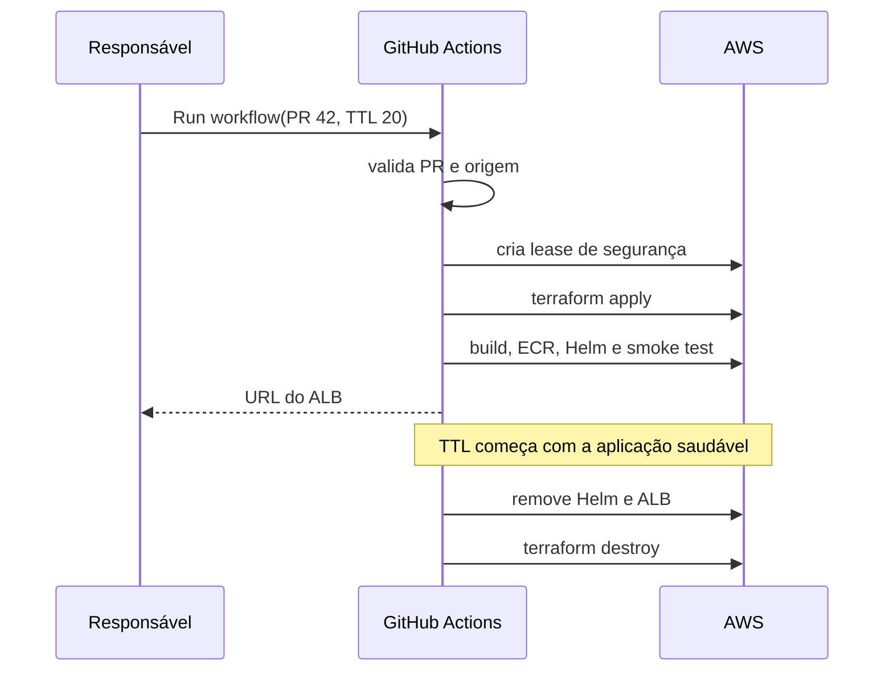

# Deploy efêmero da PoC na AWS

## Objetivo

Este guia publica somente um PR escolhido manualmente, mantém a aplicação saudável por 20 minutos por padrão e destrói o ambiente. A decisão e os trade-offs estão no [ADR-0004](adr/0004-ephemeral-cost-controlled-aws-poc.md).

`terraform plan` não cria infraestrutura. `terraform apply`, EKS, RDS, EC2, EBS, ALB e IPv4 podem gerar cobrança. AWS Budgets alerta, mas não limita gastos.

## Arquitetura da demonstração



Não são criados MSK Serverless, NAT Gateway ou customer-managed KMS key. Kafka roda com uma réplica, KRaft e storage efêmero. O EKS usa criptografia de envelope padrão com chave pertencente à AWS.

## Recursos persistentes e efêmeros

Persistem entre demonstrações:

- bucket S3 privado e versionado do Terraform state;
- provider OIDC do GitHub;
- role `operations-hub-github-poc` e policies de automação.

São criados e destruídos em cada demonstração:

- VPC, Internet Gateway, rotas e sub-redes;
- EKS 1.36 e um node Spot `t3.medium`;
- quatro repositórios ECR;
- RDS PostgreSQL `db.t4g.micro` privado;
- Secrets Manager do RDS;
- ALB criado pelo controller;
- Budget mensal;
- aplicações e Kafka instalados pelo Helm.

## 1. Bootstrap do state

Executado uma única vez com acesso humano via IAM Identity Center:

```bash
cd infra/terraform/bootstrap/state
cp terraform.tfvars.example terraform.tfvars
terraform init
terraform plan -out=state.tfplan
terraform apply state.tfplan

cp backend.tf.example backend.tf
cp backend.hcl.example backend.hcl
terraform init -migrate-state -backend-config=backend.hcl
```

O bucket possui `prevent_destroy`. Ele não faz parte do teardown efêmero.

## 2. Bootstrap OIDC e permissão efêmera

```bash
cd ../github-oidc
cp backend.hcl.example backend.hcl
terraform init -backend-config=backend.hcl
terraform plan -out=github-oidc.tfplan
terraform apply github-oidc.tfplan
terraform output github_actions_role_arn
```

A trust policy aceita somente:

```text
repo:WilliamRochaJR@38361127/operations-hub@1323559421:environment:poc
```

Este repositório usa um subject OIDC personalizado pelo GitHub, com os IDs estáveis do proprietário e do repositório. O valor foi confirmado a partir dos claims não sensíveis emitidos para o workflow na `main`; não o substitua pelo formato padrão baseado apenas nos nomes. A audience permanece restrita a `sts.amazonaws.com`.

A role não recebe `AdministratorAccess`. Ela recebe `PowerUserAccess` mais permissões IAM limitadas aos nomes do Operations Hub. A exceção de leitura é `iam:GetRole` sobre os dois ARNs exatos de `AWSServiceRoleForAmazonEKSNodegroup`: antes da criação, sem path, e depois da criação, sob `/aws-service-role/eks-nodegroup.amazonaws.com/`. A criação também é condicionada ao service name `eks-nodegroup.amazonaws.com`. Esse perfil é exclusivo para uma conta não produtiva e está documentado no ADR-0004.

O acesso administrativo ao cluster é criado uma única vez pela entrada EKS `github_actions`. Não habilite simultaneamente `enable_cluster_creator_admin_permissions`: como o workflow é também o criador do cluster, isso tentaria registrar a mesma role duas vezes.

Sempre revise o plano do bootstrap. Se já houver provider `token.actions.githubusercontent.com`, importe-o em vez de criar outro.

## 3. GitHub Environment

No Environment `poc`, configure:

| Tipo | Nome | Valor |
|---|---|---|
| Variable | `AWS_ROLE_ARN` | output `github_actions_role_arn` |
| Variable | `BUDGET_ALERT_EMAIL` | e-mail que confirmará o alerta AWS Budget |

Não configure `AWS_ACCESS_KEY_ID` nem `AWS_SECRET_ACCESS_KEY`.

## 4. Publicar um PR específico

O workflow só existe na `main` e não possui gatilho `pull_request`.

1. Abra **Actions → Deploy ephemeral PoC from PR**.
2. Clique em **Run workflow**.
3. Mantenha a branch do workflow como `main`.
4. Informe o número de um PR aberto do próprio repositório.
5. Informe TTL entre 5 e 60 minutos; o padrão é 20.

O workflow rejeita PR fechado, fork, TTL inválido e execução fora da `main`. A infraestrutura é lida do SHA confiável da `main`; somente as quatro imagens são construídas do SHA do PR.



Provisionamento de EKS/RDS pode levar dezenas de minutos e não conta no TTL. O job possui timeout total de 180 minutos.

Antes de instalar o AWS Load Balancer Controller, o workflow aguarda explicitamente pelo menos um Node EKS ficar `Ready`. A instalação possui timeout de 10 minutos. Se o Node ou o controller não ficar pronto, o log registra Nodes, Pods, logs do controller e eventos recentes do Kubernetes antes de iniciar o teardown; tokens e Secrets não são impressos por esse diagnóstico.

O controller recebe `region` e `vpcId` explicitamente, sendo o VPC ID lido do output Terraform. Ele não depende do metadata da instância: os Nodes preservam IMDSv2 obrigatório e hop limit `1`, impedindo que Pods comuns consultem o IMDS diretamente.

## 5. Teardown e watchdog

O cleanup normal usa `if: always()`:

1. remove o release `operations-hub`, incluindo o Ingress;
2. aguarda o controller remover o ALB;
3. remove o AWS Load Balancer Controller;
4. executa `terraform destroy`;
5. remove o lease S3.

O workflow **Cleanup expired PoC** roda a cada 15 minutos. Se o runner principal morrer, ele lê `operations-hub/leases/poc.json` no bucket de state e destrói o ambiente expirado.

Para emergência:

1. abra **Actions → Cleanup expired PoC**;
2. escolha **Run workflow**;
3. marque `force=true`.

O schedule do GitHub não é um relógio de tempo real e pode atrasar. Depois de uma falha, confirme no Console AWS que não restaram EKS, EC2, RDS, ALB, NAT Gateway, EIP ou MSK.

## 6. Execução local excepcional

O fluxo normal é o GitHub Actions. Para diagnóstico local:

```bash
AWS_PROFILE=operations-hub aws sts get-caller-identity
cd infra/terraform/environments/poc
cp backend.hcl.example backend.hcl
cp terraform.tfvars.example terraform.tfvars
terraform init -backend-config=backend.hcl
terraform plan -out=poc.tfplan
```

Não aplique o plano local enquanto o workflow `ephemeral-poc` estiver ativo. O lock S3 protege o state, mas não substitui coordenação humana.

Destruição local de emergência:

```bash
aws eks update-kubeconfig --region us-east-1 --name operations-hub-poc
helm uninstall operations-hub -n operations-hub --wait || true
helm uninstall aws-load-balancer-controller -n kube-system --wait || true
terraform destroy
```

## 7. Critérios de encerramento

Após cada demonstração:

```bash
terraform state list
aws eks list-clusters --region us-east-1
aws rds describe-db-instances --region us-east-1
aws elbv2 describe-load-balancers --region us-east-1
```

O state do ambiente deve ficar vazio. O bucket de state, provider OIDC e role de bootstrap continuarão existentes por decisão arquitetural.
