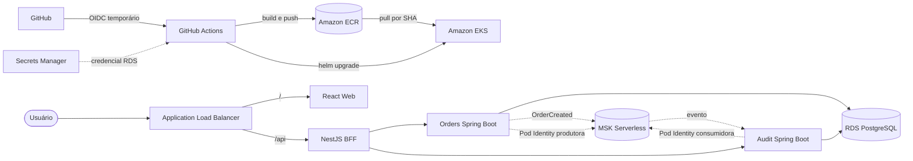
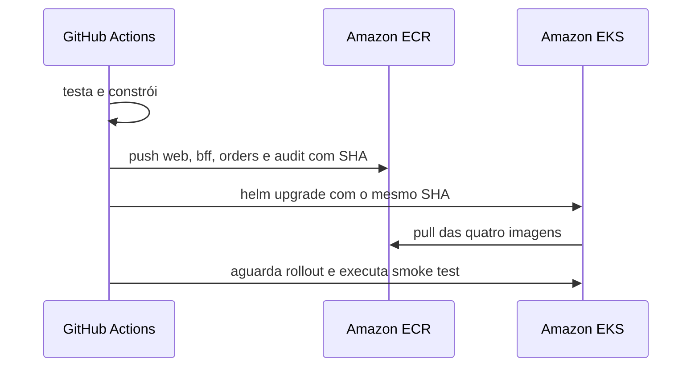

# Deploy da PoC na AWS

## Objetivo

Este guia conecta o walking skeleton local à AWS sem mudar sua arquitetura funcional. Terraform cria a infraestrutura, Docker produz imagens imutáveis, ECR armazena essas imagens e Helm instala os quatro workloads no EKS.

Nenhum comando deste documento deve ser executado em uma conta sem antes revisar custos e permissões. `terraform plan` é leitura; `terraform apply` cria recursos cobrados.

## Fluxo completo



## O que já está codificado

```text
infra/
├── terraform/
│   ├── bootstrap/state/          # bucket S3 e locking
│   ├── bootstrap/github-oidc/    # confiança GitHub e role temporária
│   └── environments/poc/         # VPC, EKS, ECR, RDS, MSK e Budget
└── helm/operations-hub/         # Deployments, Services, ConfigMap e Ingress
```

O Terraform cria:

- VPC em duas zonas de disponibilidade;
- sub-redes públicas, privadas e de banco;
- um NAT Gateway compartilhado para reduzir a quantidade de recursos;
- EKS com um node group Spot pequeno;
- quatro repositórios ECR;
- RDS PostgreSQL privado;
- MSK Serverless com autenticação IAM;
- senha gerada e gerenciada pelo RDS no Secrets Manager;
- orçamento mensal opcional;
- identidade usada pelo AWS Load Balancer Controller;
- identidades separadas para Orders e Audit.

O Helm instala `web`, `bff`, `orders-service` e `audit-service`. O Ingress envia `/api` ao BFF e as demais rotas ao React. RDS e MSK não rodam dentro do Kubernetes.

## Pré-requisitos

- uma conta AWS não produtiva;
- AWS CLI autenticado por SSO ou outra credencial temporária;
- Terraform, Docker, `kubectl` e Helm;
- permissão para VPC, EKS, EC2, IAM, ECR, RDS, MSK, Secrets Manager e Budgets;
- autorização para executar o bootstrap limitado de S3 e IAM.

Confira a identidade antes de qualquer mudança:

```bash
AWS_PROFILE=operations-hub aws sts get-caller-identity
aws configure get region
```

## 1. Preparar o state remoto

O primeiro bootstrap cria somente o bucket S3 versionado, criptografado e sem acesso público. Ele começa com state local devido à dependência circular:

```bash
cd infra/terraform/bootstrap/state
cp terraform.tfvars.example terraform.tfvars
terraform init -backend=false
terraform plan -out=state.tfplan
terraform apply state.tfplan

cp backend.hcl.example backend.hcl
terraform init -migrate-state -backend-config=backend.hcl
```

Esse é o primeiro `apply`, limitado ao bucket de state. O recurso possui `prevent_destroy`; a remoção exige uma decisão explícita.

## 2. Criar a confiança OIDC do GitHub

```bash
cd ../github-oidc
cp backend.hcl.example backend.hcl
terraform init -backend-config=backend.hcl
terraform plan -out=github-oidc.tfplan
terraform apply github-oidc.tfplan
terraform output github_actions_role_arn
```

A trust policy exige o subject exato:

```text
repo:WilliamRochaJR/operations-hub:environment:poc
```

Se a conta já possuir o provider `token.actions.githubusercontent.com`, ele deve ser importado ou referenciado; não crie outro provider igual.

## 3. Preparar a infraestrutura da PoC

```bash
cd ../../environments/poc
cp backend.hcl.example backend.hcl
cp terraform.tfvars.example terraform.tfvars
```

Edite os arquivos locais, incluindo os outputs de nome e ARN da role OIDC. Eles são ignorados pelo Git.

## 4. Revisar antes de criar

```bash
terraform init -backend-config=backend.hcl
terraform fmt -check -recursive
terraform validate
terraform plan -out=poc.tfplan
terraform show poc.tfplan
```

Somente depois de revisar o plano:

```bash
terraform apply poc.tfplan
```

O `apply` não foi executado durante a criação desta estrutura.

## 5. Conectar o kubectl

```bash
aws eks update-kubeconfig \
  --region "$(terraform output -raw aws_region)" \
  --name "$(terraform output -raw cluster_name)"
kubectl get nodes
```

## 6. Instalar o AWS Load Balancer Controller

Terraform prepara a identidade do controller, mas o componente Kubernetes é instalado pelo Helm:

```bash
helm repo add eks https://aws.github.io/eks-charts
helm repo update eks
helm upgrade --install aws-load-balancer-controller eks/aws-load-balancer-controller \
  --namespace kube-system \
  --set clusterName="$(terraform output -raw cluster_name)" \
  --set serviceAccount.create=true \
  --set serviceAccount.name=aws-load-balancer-controller
```

O papel usa uma policy AWS ampla para manter a primeira PoC legível. Essa simplificação está marcada no código e deve ser substituída pela policy mínima oficial antes de qualquer uso produtivo.

## 7. Publicar as imagens

Cada imagem recebe o SHA do commit; `latest` não é usado no CD.



O workflow `.github/workflows/deploy-poc.yml` automatiza esse processo. Configure no Environment `poc` do GitHub:

| Tipo | Nome | Exemplo/origem |
|---|---|---|
| Variable | `AWS_REGION` | `us-east-1` |
| Variable | `AWS_ROLE_ARN` | role OIDC de deploy |
| Variable | `EKS_CLUSTER_NAME` | output `cluster_name` |
| Variable | `ECR_REGISTRY` | `<account>.dkr.ecr.<region>.amazonaws.com` |
| Variable | `RDS_ENDPOINT` | output `rds_endpoint` |
| Variable | `MSK_BOOTSTRAP_SERVERS` | output `msk_bootstrap_brokers_sasl_iam` |
| Variable | `DATABASE_SECRET_ARN` | output `database_secret_arn` |

O React é construído com `VITE_API_URL=/api`, portanto usa a mesma origem pública do ALB. O navegador não acessa diretamente os microsserviços.

## 8. Segredo do banco

O próprio RDS gera, armazena e gerencia a senha master no Secrets Manager. O Terraform mantém somente o ARN. Durante o deploy, o workflow lê o JSON e cria/atualiza o Secret `operations-hub-database` no namespace. A senha não aparece em `values.yaml`, logs intencionais ou argumentos do Helm.

Essa sincronização ocorre no deploy e não acompanha rotação continuamente. Enquanto a PoC for temporária, execute novamente o workflow após uma rotação. Antes de manter o ambiente ativo por longo prazo, adote External Secrets Operator ou Secrets Store CSI Driver com uma estratégia de restart dos Pods.

## 9. MSK e autenticação IAM

Localmente, Spring usa Kafka sem autenticação. Na AWS, o chart ativa o profile Spring `aws`, que configura:

```text
security.protocol=SASL_SSL
sasl.mechanism=AWS_MSK_IAM
sasl.jaas.config=software.amazon.msk.auth.iam.IAMLoginModule required;
sasl.client.callback.handler.class=software.amazon.msk.auth.iam.IAMClientCallbackHandler
```

Os dois projetos Spring incluem `software.amazon.msk:aws-msk-iam-auth`. Orders e Audit usam ServiceAccounts e EKS Pod Identities diferentes. Orders possui permissão de escrita no tópico; Audit possui leitura e acesso apenas ao seu consumer group. Web e BFF não recebem permissão Kafka.

## 10. Validar o deploy

```bash
kubectl get pods,services,ingress -n operations-hub
kubectl rollout status deployment/web -n operations-hub
kubectl rollout status deployment/bff -n operations-hub
kubectl rollout status deployment/orders-service -n operations-hub
kubectl rollout status deployment/audit-service -n operations-hub
```

Quando o Ingress tiver endereço:

```bash
APP_URL="http://$(kubectl get ingress operations-hub -n operations-hub -o jsonpath='{.status.loadBalancer.ingress[0].hostname}')"
curl --fail "$APP_URL/health"
curl --fail "$APP_URL/api/health"
```

Depois, criar um pedido pela interface confirma o caminho completo RDS → outbox → MSK → Audit.

## 11. Destruir e controlar custos

Remova primeiro o release e confirme que o ALB desapareceu; depois destrua o Terraform:

```bash
helm uninstall operations-hub -n operations-hub
kubectl delete namespace operations-hub
terraform plan -destroy -out=destroy.tfplan
terraform apply destroy.tfplan
```

Revise também recursos órfãos no console. EKS, NAT Gateway, RDS e MSK Serverless geram cobrança mesmo com pouco ou nenhum tráfego.
