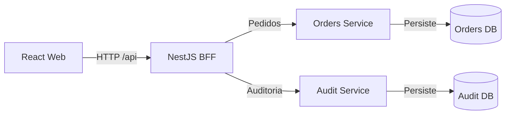

# Backend for Frontend (BFF)

## 1. Definição

BFF significa **Backend for Frontend**. É uma camada de backend criada para atender às necessidades específicas de uma interface.

Na PoC, o BFF será implementado com NestJS e ficará entre a aplicação React e a API de domínio em Spring Boot:



O navegador não acessará diretamente os microsserviços Spring. Ele consumirá contratos orientados às telas fornecidos pelo BFF.

O BFF não publica diretamente eventos de domínio. Orders Service publica no Kafka e Audit Service consome; o BFF apenas expõe ao React o estado resultante dessa integração.

## 2. Por que usar nesta PoC

O BFF permite demonstrar NestJS com uma responsabilidade arquitetural real. Ele reduz o acoplamento entre a interface e os contratos internos do backend e pode diminuir a quantidade de requisições feitas pelo navegador.

Exemplo: sem BFF, o dashboard poderia precisar consultar separadamente o resumo da operação, os pedidos recentes e dados complementares. Com o BFF, o React solicita uma visão pronta para a tela:

```http
GET /api/dashboard
```

```json
{
  "indicators": {
    "pending": 12,
    "approved": 7,
    "processing": 8,
    "shipped": 35
  },
  "recentOrders": [
    {
      "id": "a7c1f15b-8bcc-4da9-b65d-1b4f17f923f7",
      "number": "ORD-1042",
      "customerName": "Marina Souza",
      "status": "PROCESSING",
      "formattedTotal": "R$ 249,90"
    }
  ]
}
```

Esse contrato representa uma necessidade da interface, não o modelo interno de persistência.

## 3. Responsabilidades do BFF

### Composição

- agregar dados necessários para uma tela;
- executar chamadas independentes em paralelo quando apropriado;
- definir comportamento para falhas totais ou parciais;
- evitar que o React coordene vários serviços internos.

### Adaptação de contratos

- converter DTOs da API de domínio em DTOs orientados à interface;
- renomear ou agrupar campos quando isso simplificar o consumo;
- remover informações internas que não devem chegar ao navegador;
- manter o React desacoplado de mudanças internas do backend.

### Proteção da fronteira

- validar parâmetros recebidos do navegador;
- aplicar timeout nas chamadas aos microsserviços Spring;
- normalizar erros externos;
- propagar autenticação e autorização quando forem implementadas;
- criar ou propagar um `correlationId` para rastreamento.

### Otimização para a interface

- reduzir o número de requisições do navegador;
- aplicar cache curto em consultas apropriadas;
- oferecer payloads compatíveis com as necessidades de cada tela;
- preservar paginação e filtros executados no servidor.

## 4. O que não pertence ao BFF

O BFF não será a fonte de verdade do domínio. Portanto, ele não deve:

- decidir se uma transição de status é permitida;
- acessar diretamente as tabelas de pedidos;
- possuir persistência própria no MVP;
- duplicar entidades JPA ou regras da aplicação Spring;
- implementar processos de negócio autoritativos;
- esconder indisponibilidades retornando dados incorretos;
- transformar-se em um proxy sem responsabilidade adicional.

A regra principal é:

> O BFF decide como entregar dados para a interface; cada microsserviço decide o que é válido em seu domínio.

## 5. Divisão de responsabilidades

| Camada | Responsabilidade | Exemplo |
|---|---|---|
| React | Apresentação e interação | abrir detalhes e exibir feedback |
| NestJS BFF | Composição e adaptação | montar a resposta do dashboard |
| Spring Boot | Regras e casos de uso | validar uma transição de status |
| PostgreSQL | Persistência | armazenar pedido e histórico |

## 6. Contratos previstos

### Browser para BFF

```text
GET   /api/dashboard
GET   /api/orders
GET   /api/orders/{id}
PATCH /api/orders/{id}/status
GET   /api/health
```

### BFF para os microsserviços Spring

```text
GET   /orders
GET   /orders/{id}
GET   /orders/summary
PATCH /orders/{id}/status
GET   /actuator/health
```

Os caminhos podem parecer semelhantes, mas os contratos não precisam ser idênticos. O BFF pode combinar, reduzir ou reorganizar campos de acordo com a necessidade do front-end.

## 7. Exemplo de alteração de status

O React envia:

```http
PATCH /api/orders/a7c1f15b-8bcc-4da9-b65d-1b4f17f923f7/status
Content-Type: application/json
```

```json
{
  "status": "PROCESSING"
}
```

O BFF valida o formato, propaga o contexto da requisição e encaminha a ação para o Orders Service. O serviço verifica a regra de transição e persiste a mudança.

Se a transição não for permitida, o Orders Service retorna um erro de domínio. O BFF o converte para o formato público padronizado, preservando o status HTTP adequado:

```json
{
  "type": "INVALID_STATUS_TRANSITION",
  "title": "Não foi possível alterar o status",
  "status": 409,
  "detail": "A transição solicitada não é permitida.",
  "correlationId": "7db87427-6bf1-43e0-8b4a-badc5ef71d70"
}
```

O BFF não tenta corrigir ou contornar a regra rejeitada pelo Spring.

## 8. Tratamento de falhas

| Situação | Comportamento esperado |
|---|---|
| Parâmetro inválido enviado pelo React | BFF retorna 400 |
| Pedido inexistente | Spring retorna 404 e BFF normaliza a resposta |
| Transição inválida | Spring retorna 409 e BFF preserva o significado |
| Timeout no Spring | BFF retorna 504 |
| Spring indisponível | BFF retorna 503 |
| Erro inesperado | BFF retorna 500 sem expor detalhes internos |

Todas as respostas de erro devem conter `correlationId`. Logs internos podem guardar detalhes técnicos, mas esses detalhes não devem ser expostos ao navegador.

## 9. Cache

O cache será aplicado somente quando houver benefício e sem comprometer a consistência:

- resumo do dashboard pode usar cache curto;
- listagem filtrada pode depender inicialmente apenas do cache do TanStack Query;
- detalhes e alterações de status não devem retornar dados obsoletos após uma mutation;
- mutations devem invalidar ou atualizar resumo, listagem e detalhes afetados;
- respostas de erro não devem ser cacheadas como sucesso.

O cache não será incluído apenas para demonstrar tecnologia. Sua necessidade deve ser validada com comportamento ou medição.

## 10. Segurança

Mesmo com autenticação simulada no MVP, o BFF deve preparar uma fronteira segura:

- validar todas as entradas;
- limitar tamanho de payload e parâmetros de paginação;
- não confiar em dados enviados pelo browser;
- não expor stack traces ou URLs internas;
- configurar CORS apenas para origens conhecidas;
- evitar registrar tokens ou dados pessoais sensíveis;
- propagar identidade e autorização sem substituir a validação necessária no backend.

Quando autenticação real for adicionada, regras de autorização críticas continuarão validadas pela API de domínio.

## 11. Observabilidade

O BFF deve registrar, em formato estruturado:

- método e rota pública;
- status da resposta;
- duração da requisição;
- serviço interno chamado;
- resultado da chamada interna;
- `correlationId`;
- erro técnico sanitizado quando necessário.

Health checks devem distinguir a saúde do próprio processo da disponibilidade de dependências. Isso evita marcar o BFF como saudável apenas porque seu processo está em execução.

## 12. Estratégia de testes

### Testes unitários

- adaptação entre DTOs;
- composição do dashboard;
- mapeamento de erros;
- políticas de timeout e cache;
- validações próprias da fronteira HTTP.

### Testes HTTP com Supertest

- status e formato das respostas;
- validação de entrada;
- propagação do `correlationId`;
- respostas quando um microsserviço falha.

### Testes de contrato e integração

- compatibilidade entre os clients HTTP do BFF e os contratos OpenAPI dos serviços;
- comportamento real de paginação e filtros;
- jornada integrada executada pelo Playwright.

Os testes do BFF não devem repetir todos os testes das regras de negócio do Spring.

## 13. Estrutura prevista no NestJS

```text
src/
├── common/
│   ├── errors/
│   ├── http/
│   ├── interceptors/
│   └── observability/
├── dashboard/
│   ├── dashboard.controller.ts
│   ├── dashboard.service.ts
│   └── dto/
├── orders/
│   ├── orders.controller.ts
│   ├── orders.service.ts
│   ├── orders-api.client.ts
│   └── dto/
├── health/
└── main.ts
```

Controllers tratam a fronteira HTTP, services coordenam os casos de uso orientados à interface e clients encapsulam a comunicação com serviços internos.

## 14. Critério para avaliar o valor do BFF

Durante a implementação, o BFF deve demonstrar pelo menos alguns destes benefícios:

- uma resposta composta para o dashboard;
- DTO diferente do contrato interno do Spring;
- normalização consistente de erros;
- propagação de correlação;
- política explícita de timeout;
- redução de chamadas feitas pelo browser.

Se ele apenas encaminhar todas as requisições e respostas sem adaptação, sua presença deverá ser reavaliada. O objetivo é demonstrar uma fronteira útil, não adicionar uma camada cerimonial.
