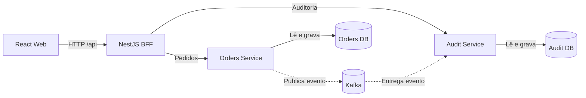
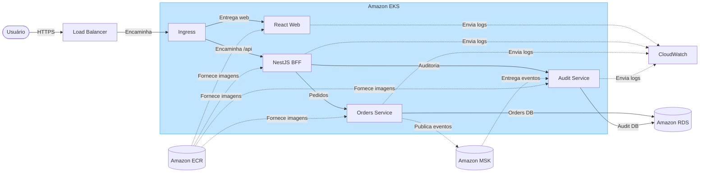

# Infraestrutura, AWS e ambientes

## 1. Objetivo

Esta estratégia define ambientes reproduzíveis para desenvolvimento local e execução na AWS. A mesma imagem de aplicação deve avançar entre ambientes; apenas configuração e segredos mudam.

## 2. Visão dos ambientes

| Ambiente | Execução | Banco | Finalidade |
|---|---|---|---|
| Desenvolvimento rápido | processos locais ou containers seletivos | PostgreSQL em container | feedback rápido |
| Integrado local | Docker Compose | PostgreSQL em container | validar o sistema completo |
| Desenvolvimento remoto | Kubernetes no AWS EKS | Amazon RDS PostgreSQL | validar deploy e integração AWS |
| Produção demonstrativa | Kubernetes no AWS EKS | Amazon RDS PostgreSQL | portfólio e demonstração |

O ambiente remoto de desenvolvimento pode ser temporário para controlar custos. Produção demonstrativa somente será criada se o deploy público fizer parte do escopo final.

## 3. Docker

Web, BFF e cada microsserviço Spring terão imagens próprias e Dockerfiles multi-stage.

Requisitos das imagens:

- builds reproduzíveis;
- dependências fixadas por lockfiles;
- somente artefatos de runtime na imagem final;
- execução como usuário sem privilégios;
- configuração recebida por variáveis ou arquivos montados;
- nenhum segredo incluído na imagem;
- logs enviados para `stdout` e `stderr`;
- endpoint de saúde adequado para cada aplicação;
- tags imutáveis usando o SHA do commit.

O PostgreSQL não terá imagem customizada. Localmente será usada a imagem oficial fixada em uma versão compatível; remotamente será usado Amazon RDS.

## 4. Docker Compose

O `compose.yaml` será a entrada principal para o ambiente integrado local:



Serviços previstos:

- `web`: build e entrega da aplicação React;
- `bff`: aplicação NestJS;
- `orders-service`: domínio de pedidos em Spring Boot;
- `audit-service`: domínio de auditoria em Spring Boot;
- `kafka`: broker local para eventos de domínio;
- `postgres`: banco local com volume nomeado;
- serviço opcional de observabilidade somente se agregar valor à PoC.

Políticas:

- health checks controlam prontidão, sem depender apenas da ordem de inicialização;
- migrations são executadas pela API ou por um job explícito;
- portas internas não são publicadas sem necessidade;
- dados de demonstração podem ser recriados por procedimento documentado;
- existe um arquivo de exemplo de variáveis sem valores secretos.

## 5. Kubernetes

O deploy Kubernetes será empacotado em um chart Helm para evitar duplicação de manifests entre ambientes.

Recursos previstos:

- `Deployment` para web, BFF e API;
- `Service` interno para cada workload;
- `Ingress` para entrada HTTP;
- `ConfigMap` para configuração não sensível;
- integração com mecanismo de segredos da AWS;
- `Job` para migrations;
- `HorizontalPodAutoscaler` apenas após existirem métricas e limites coerentes;
- `PodDisruptionBudget` se o ambiente demonstrativo usar múltiplas réplicas.

Cada workload deve declarar:

- readiness probe;
- liveness probe;
- startup probe quando a inicialização justificar;
- requests e limits de CPU e memória;
- contexto de segurança sem privilégios;
- estratégia de rolling update;
- labels comuns de aplicação, versão e componente.

PostgreSQL não será executado dentro do Kubernetes nos ambientes AWS. Banco de dados com estado será delegado ao RDS.

## 6. Serviços AWS



### Amazon EKS

Executa os workloads Kubernetes. Para uma PoC, o cluster deve permanecer pequeno e ter seu custo monitorado. O EKS demonstra Kubernetes gerenciado, mas não é obrigatório para o ciclo local.

### Amazon ECR

Armazena as imagens Docker de web, BFF e API. As imagens serão identificadas pelo SHA do commit e poderão receber uma tag adicional de ambiente apenas como referência.

### Amazon RDS for PostgreSQL

Fornece o PostgreSQL remoto, com backups, conexão criptografada e acesso restrito à rede da aplicação. Credenciais não serão armazenadas no repositório.

### Amazon MSK Serverless

Fornece Kafka gerenciado para o ambiente AWS. Orders Service produz eventos e Audit Service os consome pela rede privada, com autenticação IAM. Antes do provisionamento serão confirmados disponibilidade na região escolhida e impacto no orçamento.

No ambiente local será usado um broker Kafka em container. Os contratos e nomes de tópicos permanecem equivalentes entre ambientes; autenticação e endereços são configuração externa.

### Rede e entrada

- VPC com sub-redes públicas para entrada e privadas para workloads e banco;
- Security Groups com acesso mínimo necessário;
- Application Load Balancer integrado ao Ingress;
- TLS com certificado gerenciado;
- DNS opcional, caso exista deploy público.

### Configuração, segredos e logs

- serviço gerenciado de segredos para credenciais;
- IAM por workload quando houver necessidade de acessar APIs AWS;
- logs centralizados no CloudWatch;
- alarmes mínimos para indisponibilidade e erros elevados;
- orçamento e alertas de custo para evitar recursos esquecidos.

## 7. Infraestrutura como código

A infraestrutura AWS será descrita em Terraform:

```text
infra/
├── helm/
│   └── operations-hub/
└── terraform/
    ├── modules/
    └── environments/
        ├── development/
        └── production/
```

Princípios:

- mudanças passam por `terraform plan` no CI;
- aplicação de infraestrutura exige ambiente protegido;
- state remoto e locking serão configurados antes do uso compartilhado;
- recursos recebem tags de projeto, ambiente e propriedade;
- o procedimento de destruição é documentado para controlar custos;
- segredos e arquivos de state nunca são versionados.

## 8. Conectividade

- browser acessa somente o endpoint público da aplicação;
- web encaminha chamadas `/api` ao BFF;
- BFF acessa os microsserviços Spring pelos Services internos;
- somente os microsserviços acessam suas áreas de dados no PostgreSQL;
- Orders Service publica no Kafka e Audit Service consome do Kafka;
- RDS aceita conexão apenas da origem necessária na rede privada;
- endpoints internos não devem ser expostos pelo Ingress.

## 9. Migrations

Flyway continuará responsável pelas migrations. No Kubernetes, elas serão executadas por um Job anterior ao rollout:

- migration deve ser compatível com a versão atual e a nova durante rolling update;
- apenas uma execução pode alterar o schema por deploy;
- falha de migration interrompe a publicação;
- rollback de aplicação não deve depender de desfazer automaticamente uma migration destrutiva;
- mudanças incompatíveis seguem estratégia expand-and-contract.

## 10. Escalabilidade e disponibilidade

A PoC documentará práticas de produção sem fingir uma escala inexistente:

- BFF e API permanecem stateless;
- sessões não são armazenadas em memória local;
- paginação limita consultas e payloads;
- recursos do Kubernetes começam conservadores e são ajustados com métricas;
- múltiplas réplicas serão usadas somente quando o ambiente justificar;
- HPA não será configurado antes de requests, limits e métricas estarem corretos.

## 11. Segurança mínima

- princípio de menor privilégio para IAM e Security Groups;
- workloads sem root e filesystem somente leitura quando viável;
- imagens verificadas antes da publicação;
- TLS na entrada e na conexão com o banco;
- dependências e imagens examinadas no CI;
- nenhum segredo em código, Helm values ou logs;
- acesso administrativo ao cluster restrito e auditável.

## 12. Controle de custos

EKS, RDS e MSK possuem custo mesmo com pouco tráfego. Antes de criar o ambiente serão definidos:

- orçamento mensal e alertas;
- tamanho mínimo aceitável dos recursos;
- horário ou procedimento de desligamento do que for temporário;
- política de retenção de logs e imagens;
- comando documentado para destruir todo o ambiente da PoC.

Como alternativa futura de menor custo operacional, a mesma arquitetura de containers pode ser avaliada em ECS/Fargate. A escolha inicial por EKS existe para demonstrar Kubernetes, conforme requisito da PoC.

## 13. Critérios de aceite da infraestrutura

- um comando documentado inicia o ambiente integrado local;
- as mesmas imagens são usadas localmente e na AWS;
- chart Helm passa por lint e renderização no CI;
- workloads tornam-se prontos somente após suas dependências funcionais;
- migrations falhas impedem o deploy;
- nenhum segredo está versionado;
- deploy e rollback possuem procedimento testado;
- ambiente AWS pode ser destruído de forma reproduzível.
