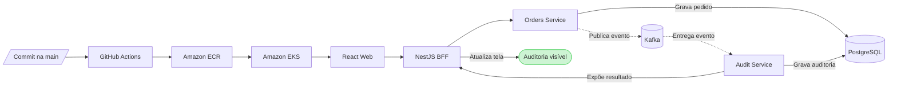

# Matriz de adoção tecnológica

## Objetivo

Esta matriz torna explícito quando e como cada tecnologia planejada entra no sistema. A regra é: tecnologias arquiteturais e de integração devem ser exercitadas no walking skeleton; funcionalidades avançadas evoluem depois, guiadas pelas fatias de negócio.

“Presente” não significa apenas dependência instalada. Cada item precisa de uma evidência executável.

## Walking skeleton

| Tecnologia | Aplicação inicial | Evidência esperada |
|---|---|---|
| React | página de criação e acompanhamento do pedido mínimo | interface consome o BFF e mostra consistência eventual |
| TypeScript | web e BFF em modo strict | typecheck no CI |
| React Router | rota da demonstração | navegação testável e link direto |
| TanStack Query | query e mutation do fluxo | cache atualizado após processamento |
| Zustand | preferência visual pequena | store isolado sem duplicar estado remoto |
| Tailwind CSS | layout responsivo mínimo | interface móvel e desktop |
| NestJS | BFF do fluxo ponta a ponta | contrato público, composição e erros normalizados |
| Java 21 | runtime dos microsserviços | build e testes no CI |
| Spring Boot | Orders e Audit Services | endpoints, producer e consumer reais |
| PostgreSQL | pedidos, outbox e auditoria | migrations e persistência verificadas |
| Flyway | schemas iniciais | migrations aplicadas localmente e no deploy |
| Kafka | transporte de `OrderCreated` | evento produzido e consumido |
| Docker | imagem de cada aplicação | builds imutáveis pelo SHA |
| Docker Compose | ambiente integrado local | fluxo completo executado localmente |
| Kubernetes | execução remota dos workloads | Deployments, Services, Ingress e probes |
| Helm | empacotamento Kubernetes | chart validado e aplicado pelo pipeline |
| Terraform | infraestrutura AWS | plan versionado e apply protegido |
| AWS EKS | execução Kubernetes | workloads disponíveis no ambiente remoto |
| AWS ECR | registro de imagens | imagens publicadas pelo CI |
| AWS RDS | PostgreSQL remoto | Orders e Audit acessam somente seus dados |
| Kafka KRaft no EKS | Kafka remoto efêmero | produção e consumo do evento na AWS sem MSK ocioso |
| AWS MSK | evolução de produção | decisão documentada, não provisionada na PoC econômica |
| GitHub Actions | CI/CD | teste, build, publicação, deploy e smoke test |
| JUnit e Mockito | unidade dos serviços | regras, outbox e idempotência testadas |
| Testcontainers | integração real | PostgreSQL e Kafka exercitados no CI |
| Vitest e RTL | unidade e componente React | estados principais da tela verificados |
| Jest e Supertest | unidade e HTTP do BFF | composição, validação e erros verificados |
| Playwright | E2E do fluxo completo | pedido chega à auditoria dentro do timeout |
| axe | acessibilidade básica | nenhuma violação crítica no fluxo inicial |

## Evolução posterior

| Área | Walking skeleton | Evolução |
|---|---|---|
| Front-end | visual simples e responsivo | design system, filtros, detalhes e performance |
| BFF | um fluxo composto | dashboard, cache e falhas parciais |
| Microsserviços | Orders e Audit mínimos | regras completas, paginação e histórico |
| Kafka | um evento versionado | novos eventos, schema registry e telemetria ampliada |
| PostgreSQL | schemas mínimos | índices, tuning e migrations expand-and-contract |
| Kubernetes | recursos essenciais | autoscaling e políticas de disponibilidade baseadas em métricas |
| AWS | uma região e ambiente pequeno | hardening conforme custo, risco e objetivo do portfólio |
| CI/CD | pipeline funcional | paralelismo, segurança de supply chain e promoção mais sofisticada |
| Testes | jornada crítica | maior variedade de falhas, acessibilidade e performance |

## Regras de adoção

- nenhuma tecnologia será incluída apenas para aparecer no README;
- toda tecnologia terá um cenário, teste ou artefato que demonstre seu uso;
- o primeiro uso será o menor comportamento capaz de validar a integração real;
- complexidade operacional avançada pode ficar para depois;
- remover uma tecnologia planejada exige ADR com justificativa;
- adicionar uma nova tecnologia exige responsabilidade clara e impacto no custo do MVP.

## Critério global do primeiro marco

O walking skeleton estará completo quando o seguinte caminho funcionar localmente e na AWS:

