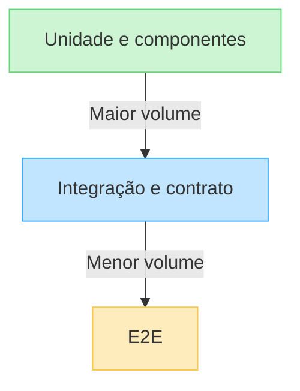
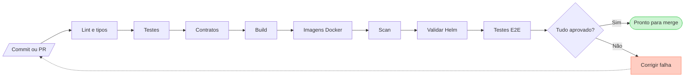
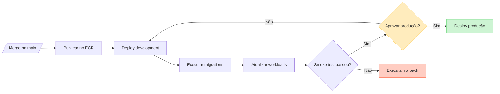

# Testes e CI/CD

## 1. Objetivo

A estratégia combina testes rápidos e focados com verificações integradas e uma jornada ponta a ponta. CI fornece feedback em toda pull request; CD promove exatamente as imagens já validadas.

## 2. Pirâmide de testes



A quantidade diminui conforme o teste fica mais amplo, lento e sujeito a variações. A escolha do nível depende do risco e não de uma meta arbitrária de cobertura.

## 3. Testes unitários

### React

- funções de transformação e validação;
- custom hooks com comportamento relevante;
- reducers ou stores Zustand;
- formatação e regras estritamente de apresentação.

Ferramentas: Vitest e Testing Library quando o teste exigir renderização.

### NestJS BFF

- composição do dashboard;
- adaptação entre DTOs;
- normalização de erros;
- timeout, cache e propagação de correlação.

Ferramenta: Jest, com clients externos substituídos por doubles controlados.

### Spring Boot

- regras de transição de status;
- casos de uso e invariantes;
- validações de domínio;
- mapeamentos sem dependência de infraestrutura.
- serialização de eventos, outbox e idempotência do consumidor.

Ferramentas: JUnit 5, Mockito e AssertJ.

## 4. Testes de componentes/UI

React Testing Library verificará comportamentos observáveis:

- loading, vazio, erro e sucesso;
- busca, filtros e paginação;
- abertura dos detalhes;
- confirmação e feedback de alteração de status;
- navegação por teclado e nomes acessíveis;
- violações de acessibilidade com axe.

MSW simulará a fronteira HTTP. Os testes devem consultar elementos por papel e nome acessível, evitando seletores ligados à estrutura interna.

## 5. Testes de integração

### BFF

- controllers e pipes executados pela aplicação NestJS real;
- chamadas HTTP verificadas com Supertest;
- microsserviços Spring simulados na fronteira de rede;
- status, headers e formato de erro validados.

### Spring Boot

- aplicação conectada a PostgreSQL real em Testcontainers;
- migrations Flyway aplicadas no início do teste;
- repositories, paginação, filtros e transações validados;
- endpoints exercitados pela fronteira HTTP.
- producer e consumer exercitados com Kafka real em Testcontainers;
- duplicidade e falha de consumo verificadas de forma determinística.

Mocks não substituirão PostgreSQL nos testes destinados a validar queries, migrations ou comportamento transacional.

### Contratos

- OpenAPI validado no CI;
- cliente do BFF verificado contra o contrato Spring;
- mudanças incompatíveis detectadas antes do merge;
- schemas dos eventos Kafka versionados e validados;
- exemplos de resposta usados como documentação, não como substitutos dos testes.

## 6. Testes end-to-end

Playwright executará o sistema completo com dados determinísticos.

Jornada crítica inicial:

1. abrir a listagem;
2. filtrar pedidos por status;
3. pesquisar um pedido;
4. abrir detalhes;
5. alterar o status;
6. confirmar atualização na lista e no histórico.
7. confirmar que a auditoria originada pelo evento foi processada.

Cenários adicionais prioritários:

- estado vazio;
- erro recuperável da API;
- transição de status rejeitada;
- viewport móvel;
- navegação principal por teclado.

No CI, falhas devem preservar trace, screenshot, vídeo quando útil e logs dos serviços.

## 7. Dados de teste

- factories criam dados focados em cada cenário;
- seeds E2E possuem identificadores previsíveis;
- testes não dependem da ordem de execução;
- banco de integração é isolado do desenvolvimento;
- cada execução começa de um estado conhecido;
- dados pessoais reais não são utilizados.

## 8. Cobertura

Cobertura será acompanhada para encontrar áreas esquecidas, não para incentivar testes sem valor.

Prioridades de cobertura:

- todas as transições de status;
- mapeamento de erros do BFF;
- estados principais dos componentes;
- paginação e filtros;
- pelo menos uma jornada E2E completa.

Um limite mínimo poderá ser definido após a primeira fatia vertical estabelecer uma linha de base realista.

## 9. Integração contínua



### Pull request

O pipeline executará:

1. validação de formatação e lint;
2. verificação de tipos e compilação;
3. testes unitários e de componentes;
4. testes de integração com PostgreSQL;
5. validação de OpenAPI, eventos e migrations;
6. build de web, BFF e API;
7. build das imagens Docker;
8. scan de dependências e imagens;
9. lint e renderização do chart Helm;
10. E2E em mudanças relevantes ou em suíte obrigatória otimizada.

Jobs independentes devem executar em paralelo. Caches aceleram downloads, mas não podem substituir artefatos nem ocultar falhas.

### Branch principal

Após merge em `main`:

1. repetir validações necessárias;
2. gerar imagens imutáveis;
3. publicar imagens no Amazon ECR com SHA do commit;
4. registrar metadados e artefatos da versão;
5. iniciar o fluxo de entrega contínua.

## 10. Entrega contínua



### Desenvolvimento remoto

- deploy automático após publicação das imagens;
- Helm aplica configuração do ambiente;
- Job executa migrations;
- rollout aguarda readiness probes;
- smoke test valida health checks e jornada mínima;
- falha impede promoção.

### Produção demonstrativa

- usa as mesmas imagens aprovadas em desenvolvimento;
- requer aprovação em ambiente protegido;
- registra executor, commit e versão;
- executa migration compatível antes do rollout;
- realiza smoke test após publicação;
- falha aciona procedimento de rollback.

## 11. Rollback

- imagens anteriores permanecem disponíveis por política de retenção;
- Helm mantém histórico suficiente para reversão;
- aplicação pode retornar à versão anterior sem depender de migration destrutiva;
- expand-and-contract protege mudanças de schema;
- rollback e roll-forward devem ser ensaiados antes de considerar o CD pronto.

## 12. Workflows previstos

```text
.github/workflows/
├── ci.yml
├── e2e.yml
├── images.yml
├── infrastructure-plan.yml
├── deploy-development.yml
└── deploy-production.yml
```

Separar workflows melhora permissões e torna o caminho de promoção explícito. Workflows de deploy recebem apenas as permissões necessárias e devem preferir autenticação temporária em vez de chaves estáticas.

## 13. Qualidade e segurança do pipeline

- ações externas fixadas em versões controladas;
- ambientes protegidos para operações sensíveis;
- credenciais temporárias para AWS;
- artefatos assinados ou acompanhados de proveniência quando viável;
- geração de SBOM avaliada para as imagens;
- secrets nunca impressos nos logs;
- concorrência de deploy controlada por ambiente;
- cancelamento de pipelines obsoletos em branches de feature.

## 14. Critérios de aceite

- pull requests recebem feedback automatizado antes da revisão final;
- regras críticas possuem testes unitários;
- integração Spring usa PostgreSQL real via Testcontainers;
- componentes React cobrem estados principais e acessibilidade;
- Playwright cobre a jornada crítica;
- apenas imagens aprovadas são promovidas;
- deploy em desenvolvimento é automático;
- deploy de produção exige aprovação;
- falha de migration ou smoke test interrompe a entrega;
- rollback possui procedimento documentado e testado.
