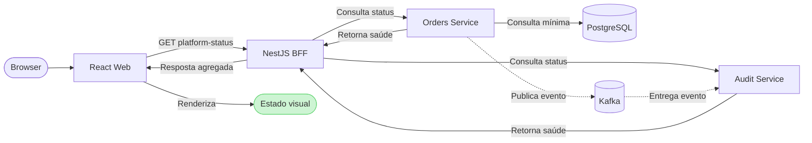
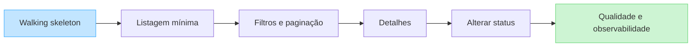

# ADR-0001 — Começar por um walking skeleton integrado

- **Status:** Aceito
- **Data:** 2026-08-04
- **Responsáveis:** projeto Operations Hub
- **Substitui:** nenhuma decisão
- **Substituído por:** —

## Contexto

A PoC precisa demonstrar React, NestJS como BFF, Java/Spring, microsserviços, PostgreSQL, containers, Kubernetes, AWS e CI/CD.

Uma implementação sequencial por camada — concluir todo o backend, depois todo o BFF, depois todo o front-end e somente no fim preparar infraestrutura — posterga os maiores riscos. A equipe passa muito tempo sem uma funcionalidade visível e descobre tarde problemas de contrato, rede, configuração, deploy e observabilidade.

Ao mesmo tempo, tentar entregar toda a arquitetura de produção no primeiro incremento criaria custo e complexidade incompatíveis com um MVP.

## Decisão

O projeto começará com um **walking skeleton**: uma fatia funcional mínima que atravessa todas as camadas e é publicada desde o início.

O primeiro incremento terá:

- uma página React simples que exibe o estado da integração;
- um endpoint público no NestJS BFF;
- chamadas reais do BFF aos microsserviços Spring;
- acesso real ao PostgreSQL por pelo menos um microsserviço;
- publicação e consumo reais de um evento Kafka;
- imagens Docker de todos os componentes;
- ambiente local integrado por Docker Compose;
- deploy Kubernetes na AWS;
- pipeline CI/CD com testes, publicação de imagens e deploy;
- logs e correlation ID atravessando o fluxo.

A arquitetura nasce integrada, mas a funcionalidade começa pequena. Depois do primeiro fluxo, o endpoint técnico e o visual simples serão substituídos progressivamente pelas fatias reais de pedidos.

## Primeiro fluxo vertical

As setas pontilhadas representam a comunicação assíncrona detalhada no [ADR-0002](0002-kafka-in-first-vertical-slice.md). As demais setas representam o caminho síncrono usado para montar o estado visual.

## Evolução por fatias

A tela deve mostrar, sem expor informações sensíveis:

- versão da aplicação;
- disponibilidade do BFF;
- disponibilidade dos serviços;
- conectividade funcional com o banco;
- correlation ID da requisição.

`/api/platform-status` é um recurso temporário de integração e demonstração. Ele não substitui probes do Kubernetes nem deve expor credenciais, topologia privada, stack traces ou detalhes administrativos.

## Microsserviços iniciais

A primeira topologia terá dois serviços Spring pequenos, com responsabilidades separadas:

### Orders Service

- fonte de verdade para pedidos;
- proprietário das tabelas de pedidos e histórico de status;
- primeira consulta funcional ao PostgreSQL;
- base das primeiras histórias de negócio.

### Audit Service

- recebe e consulta eventos de auditoria da operação;
- mantém armazenamento e contrato próprios;
- começa com uma integração mínima e evolui quando alterações de status forem implementadas.

O BFF não acessa os bancos dos serviços. Cada serviço é proprietário de seus dados, mesmo que a PoC inicialmente utilize uma única instância RDS com bancos ou schemas logicamente separados para reduzir custos.

Não serão criados serviços adicionais sem uma responsabilidade de negócio clara.

## Arquitetura AWS inicial simplificada

O primeiro ambiente remoto usará:

- uma conta e uma região AWS;
- um cluster EKS;
- um namespace da aplicação;
- um Ingress/Load Balancer;
- um repositório ECR por imagem;
- uma instância RDS PostgreSQL pequena;
- um cluster Amazon MSK Serverless;
- um chart Helm com configuração por ambiente;
- GitHub Actions autenticado na AWS sem chaves permanentes;
- logs básicos centralizados.

Inicialmente não serão exigidos:

- múltiplos clusters ou regiões;
- service mesh;
- autoscaling sofisticado;
- alta disponibilidade multi-região;
- deploy canary ou blue/green;
- observabilidade distribuída completa;
- ambientes efêmeros por pull request.

Esses itens somente serão adicionados quando resolverem um risco ou demonstrarem uma competência prioritária.

## Estratégia de evolução

Depois do walking skeleton, o sistema crescerá por fatias verticais:

1. substituir o status técnico pela listagem mínima de pedidos;
2. adicionar filtros e paginação em todas as camadas;
3. adicionar detalhes do pedido;
4. adicionar alteração de status e auditoria;
5. ampliar dashboard, acessibilidade, performance e observabilidade;
6. endurecer infraestrutura e entrega conforme o risco real.

Cada fatia deve incluir, quando aplicável:

- contrato;
- backend;
- BFF;
- interface;
- testes;
- telemetria;
- deploy.

## Alternativas consideradas

### Construir uma camada inteira por vez

Rejeitada porque atrasa feedback visual e validação das integrações.

### Desenvolver tudo localmente e adicionar AWS no final

Rejeitada porque posterga descoberta de problemas de container, IAM, rede, configuração e deploy.

### Implementar a arquitetura final completa no início

Rejeitada porque aumenta custo e tempo antes de existir uma jornada de negócio validada.

### Começar como monólito e extrair serviços posteriormente

Não escolhida para esta PoC porque microsserviços e sua integração fazem parte explícita do objetivo de demonstração. A quantidade de serviços continuará deliberadamente pequena.

## Consequências positivas

- progresso visível desde o primeiro incremento;
- contratos e conectividade são validados cedo;
- CI/CD e AWS evoluem junto com o produto;
- problemas de integração deixam de se acumular para o final;
- toda nova funcionalidade pode ser demonstrada ponta a ponta;
- a arquitetura é exercitada continuamente, não apenas documentada.

## Consequências negativas e controles

| Consequência | Controle |
|---|---|
| Fundação inicial atravessa muitas tecnologias | manter o primeiro comportamento mínimo |
| EKS e RDS geram custo cedo | orçamento, alertas e procedimento de destruição |
| Dois serviços aumentam operação | limitar a dois serviços com fronteiras claras |
| Pipeline inicial pode ficar lento | testes rápidos primeiro e jobs independentes em paralelo |
| Endpoint técnico pode virar dívida | marcar como temporário e removê-lo após a primeira jornada real |
| Infraestrutura simplificada não é altamente disponível | documentar a concessão e endurecer apenas se necessário |

## Critérios de validação

A decisão estará comprovada quando:

- um commit em `main` produzir imagens imutáveis;
- o pipeline publicar as imagens e atualizar o ambiente AWS;
- o React exibir a resposta agregada do BFF;
- o BFF comprovar comunicação com os dois serviços;
- o Orders Service comprovar uma consulta real ao PostgreSQL;
- o Orders Service publicar e o Audit Service consumir um evento Kafka;
- logs permitirem seguir a requisição por correlation ID;
- o mesmo fluxo puder ser executado pelo Docker Compose;
- um smoke test automatizado validar o fluxo depois do deploy.

## Gatilhos para revisão

Esta decisão deve ser revista se:

- o custo da AWS impedir a continuidade da PoC;
- um dos serviços não apresentar responsabilidade independente;
- o tempo de manutenção da infraestrutura superar o tempo de evolução do produto;
- restrições reais exigirem outro serviço de execução na AWS;
- o endpoint temporário permanecer após as primeiras funcionalidades reais.
