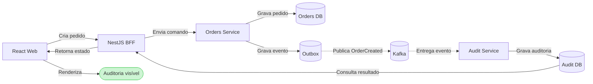

# ADR-0002 — Integrar Kafka na primeira fatia vertical

- **Status:** Aceito
- **Data:** 2026-08-04
- **Responsáveis:** projeto Operations Hub
- **Complementa:** ADR-0001
- **Substituído por:** —

## Contexto

O walking skeleton definido no ADR-0001 integra front-end, BFF, microsserviços, banco, containers, Kubernetes, AWS e CI/CD. Kafka também pertence à arquitetura planejada e não deve aparecer apenas em uma fase final, quando contratos e comunicação síncrona já estiverem consolidados.

Incluir um broker sem produzir e consumir um evento real daria uma falsa sensação de integração. Por outro lado, implementar diversos tópicos, schemas e fluxos de recuperação no primeiro incremento ampliaria demais o MVP.

## Decisão

Kafka fará parte da primeira fatia vertical por meio de um evento de domínio real e mínimo:

1. React solicita a criação de um pedido de demonstração ao BFF;
2. BFF envia o comando ao Orders Service;
3. Orders Service grava o pedido e um registro de outbox na mesma transação;
4. o publicador da outbox envia `OrderCreated` ao Kafka;
5. Audit Service consome o evento de forma idempotente;
6. Audit Service grava o evento em sua própria área de dados;
7. React consulta o resultado pelo BFF e exibe a evolução do fluxo.



O endpoint `/api/platform-status` continuará existindo apenas como visão técnica temporária. A criação de pedido será o fluxo que comprova a integração funcional e assíncrona.

## Contrato inicial do evento

Tópico:

```text
orders.events.v1
```

Envelope mínimo:

```json
{
  "eventId": "uuid",
  "eventType": "OrderCreated",
  "schemaVersion": 1,
  "occurredAt": "2026-08-04T12:00:00Z",
  "correlationId": "uuid",
  "aggregateId": "uuid",
  "payload": {
    "orderNumber": "ORD-1042",
    "status": "PENDING"
  }
}
```

O `aggregateId` será a chave da mensagem para preservar a ordem dos eventos de um mesmo pedido. O contrato será versionado no repositório e terá teste de compatibilidade.

## Confiabilidade mínima

- transactional outbox evita gravar o pedido sem registrar a intenção de publicar o evento;
- o publicador pode reenviar mensagens, portanto consumidores devem ser idempotentes;
- Audit Service registra `eventId` processados e ignora duplicatas;
- offset só é confirmado depois da persistência da auditoria;
- falhas transitórias possuem retry limitado;
- mensagens que excederem as tentativas são encaminhadas para um tópico de erro;
- correlation ID é propagado no envelope e nos logs;
- não haverá garantia de processamento exatamente uma vez entre serviços.

Tópico de erro previsto:

```text
orders.events.v1.dlq
```

## Ambientes

### Local

Docker Compose executará um broker Kafka em modo apropriado para desenvolvimento, além de web, BFF, serviços e PostgreSQL.

### AWS

Será usado Amazon MSK Serverless para reduzir a operação de brokers no EKS. Os workloads acessarão o cluster pela rede privada e usarão autenticação IAM. Essa escolha mantém Kafka real e gerenciado, mas exige validar disponibilidade regional e custo antes do provisionamento.

O Terraform será responsável por cluster, rede, políticas IAM e informações de conexão. Tópicos serão administrados por automação explícita, não criados silenciosamente pela aplicação em produção.

## Testes desde o primeiro incremento

- unidade: serialização, outbox e idempotência;
- integração: producer e consumer com Kafka real via Testcontainers;
- contrato: compatibilidade do evento versionado;
- E2E: pedido criado aparece na auditoria dentro de um tempo limite;
- smoke test AWS: produz e consome um evento sem depender de inspeção manual.

Testes assíncronos devem aguardar uma condição observável com timeout. Sleeps fixos não serão usados como sincronização.

## Alternativas consideradas

### Apenas subir Kafka sem evento real

Rejeitada porque valida processo e rede, mas não valida contrato, publicação, consumo ou idempotência.

### Publicar diretamente depois do commit

Rejeitada porque uma falha entre a gravação do pedido e a publicação pode perder o evento. A outbox mantém a intenção de publicação na mesma transação do domínio.

### Executar Kafka dentro do EKS

Não escolhida para o ambiente AWS inicial porque introduz operação de storage, brokers e recuperação no cluster da aplicação. Pode ser reconsiderada se custo do serviço gerenciado inviabilizar a PoC.

### Adicionar Kafka somente após o MVP funcional

Rejeitada porque contraria a estratégia integration-first e posterga um dos principais riscos arquiteturais.

## Consequências positivas

- comunicação assíncrona é exercitada desde o primeiro incremento;
- contrato de evento e idempotência evoluem junto com o domínio;
- ambiente local, AWS e CI validam a mesma topologia conceitual;
- Audit Service passa a ter uma responsabilidade independente e justificável;
- falhas distribuídas são descobertas cedo.

## Consequências negativas e controles

| Consequência | Controle |
|---|---|
| Mais infraestrutura no início | limitar a um evento e dois tópicos |
| Consistência eventual na interface | mostrar estado de processamento e permitir atualização |
| MSK adiciona custo | orçamento, alertas e destruição do ambiente temporário |
| Outbox adiciona código | componente pequeno, isolado e testado |
| Eventos podem ser duplicados | consumidor idempotente por `eventId` |
| Debug distribuído é mais difícil | correlation ID e logs estruturados |

## Critérios de validação

- criação de pedido grava domínio e outbox atomicamente;
- `OrderCreated` é publicado no tópico versionado;
- Audit Service processa o evento e persiste uma única auditoria;
- reprocessar o mesmo `eventId` não duplica dados;
- fluxo funciona no Docker Compose e na AWS;
- teste de integração usa Kafka real;
- E2E comprova consistência eventual sem sleep fixo;
- falha de consumo é observável e possui caminho para DLQ.

## Gatilhos para revisão

- MSK Serverless não está disponível na região escolhida;
- custo do MSK é incompatível com o orçamento da PoC;
- requisitos de schema justificam adoção de um registry;
- volume ou ordenação exigem nova estratégia de particionamento;
- outbox por polling não atende à latência necessária.
