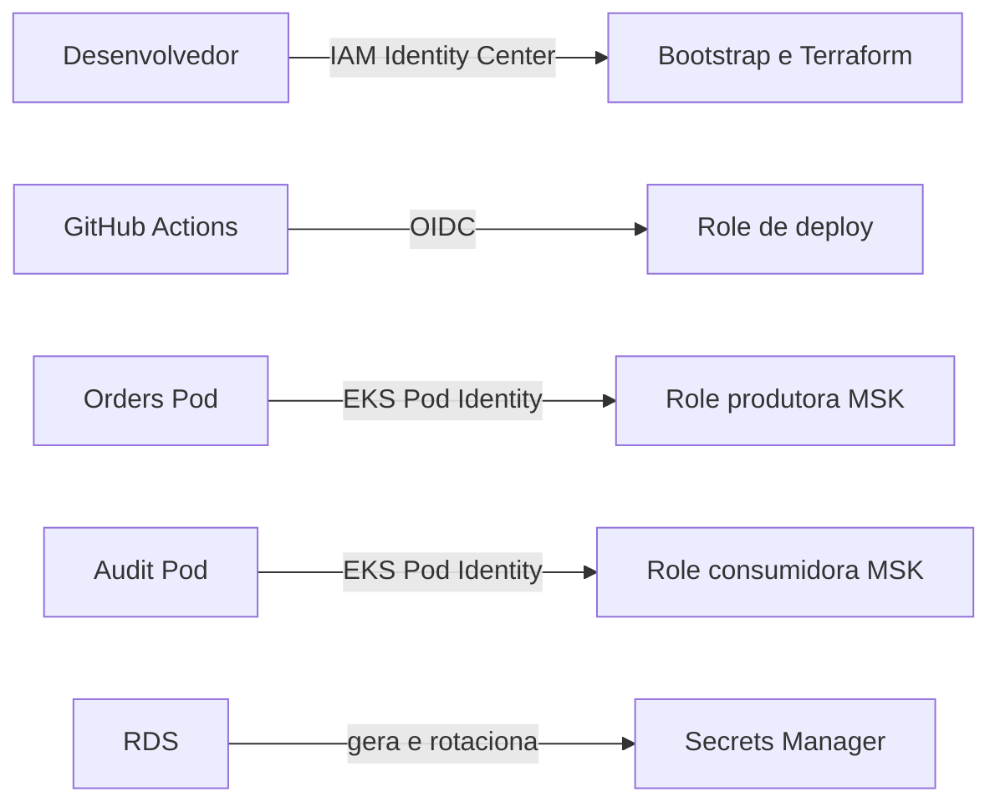

# ADR-0003 — Identidades temporárias e segredos gerenciados na AWS

- **Status:** Aceito
- **Data:** 2026-08-06
- **Responsáveis:** equipe da PoC Operations Hub
- **Substitui:** simplificações iniciais de IAM documentadas na infraestrutura
- **Substituído por:** —

## Contexto

O walking skeleton precisa demonstrar integração real com AWS sem armazenar Access Keys no GitHub, nas imagens ou na aplicação. A primeira versão da infraestrutura concedia acesso ao MSK pelo papel dos nodes EKS e gerava a senha do RDS no Terraform. Isso funcionaria tecnicamente, mas ampliaria o alcance das permissões e colocaria o valor da senha no state.

Há quatro atores com responsabilidades diferentes:

## Decisão

1. Pessoas acessam a conta com AWS CLI v2 e credenciais temporárias, preferencialmente pelo IAM Identity Center.
2. O bootstrap é dividido em state S3 e confiança OIDC do GitHub.
3. A trust policy OIDC aceita somente `WilliamRochaJR/operations-hub` no GitHub Environment `poc`.
4. A role GitHub não recebe `AdministratorAccess`; o ambiente da PoC adiciona apenas permissões para ECR, leitura do cluster EKS e leitura do segredo RDS criado por ele.
5. Orders e Audit usam Kubernetes ServiceAccounts diferentes e EKS Pod Identity.
6. Orders pode produzir no tópico `orders.events.v1`; Audit pode consumir esse tópico e usar o grupo `audit-service`.
7. Web e BFF não recebem permissões Kafka.
8. O papel dos nodes não recebe acesso funcional ao MSK.
9. O RDS gera e gerencia a senha master no Secrets Manager; o Terraform conhece o ARN, não o valor da senha.
10. O workflow sincroniza o segredo para Kubernetes somente como solução transitória da PoC.

## Alternativas consideradas

### Access Keys no GitHub

Rejeitada porque cria credenciais permanentes, aumenta o impacto de vazamento e exige rotação manual.

### Permissão Kafka no papel dos nodes

Rejeitada como estado final porque qualquer Pod capaz de alcançar as credenciais do node poderia herdar permissões além de sua função.

### Uma única role para Orders e Audit

Rejeitada porque mistura produção e consumo, impedindo menor privilégio e auditoria clara.

### Senha gerada por `random_password`

Rejeitada porque o valor é persistido no Terraform state mesmo quando marcado como sensível.

### External Secrets Operator desde o primeiro deploy

Adiada para manter o primeiro ambiente pequeno. É a evolução prevista para sincronização e rotação contínuas.

## Consequências positivas

- nenhuma Access Key permanente é necessária no pipeline;
- permissões Kafka ficam isoladas por microsserviço;
- CloudTrail consegue atribuir ações à role correta;
- a senha não aparece no código, Helm values ou Terraform state;
- bootstrap e infraestrutura da aplicação possuem ciclos de vida distintos;
- a trust policy impede uso da role por outro repositório ou environment.

## Consequências negativas e controles

- o bootstrap exige um `apply` inicial e limitado antes do plan da aplicação;
- um provider OIDC GitHub existente na conta deve ser importado em vez de duplicado;
- a role de deploy recebe acesso administrativo ao cluster Kubernetes da PoC para instalar recursos Helm; ambientes futuros devem reduzir esse escopo;
- a policy temporária do AWS Load Balancer Controller continua mais ampla que o desejável;
- o Secret Kubernetes não acompanha automaticamente a rotação do RDS. Enquanto não houver External Secrets Operator ou CSI com estratégia de restart, o ambiente deve ser temporário e o workflow deve ser executado novamente após uma rotação.

## Critérios de validação

- trust policy contém audience `sts.amazonaws.com` e subject exato do environment `poc`;
- web e BFF não possuem associação Pod Identity;
- Orders publica e Audit consome usando roles distintas;
- node group não possui policy funcional de MSK;
- output do banco expõe somente o ARN do segredo gerenciado pelo RDS;
- GitHub Actions autentica sem secrets de Access Key;
- Terraform e Helm passam em validação no CI.

## Gatilhos para revisão

- criação de ambiente de produção;
- adoção de múltiplas contas AWS;
- ambiente permanecendo ativo por mais que uma demonstração curta;
- novos serviços ou tópicos Kafka;
- adoção de GitOps, External Secrets Operator ou Secrets Store CSI Driver.
