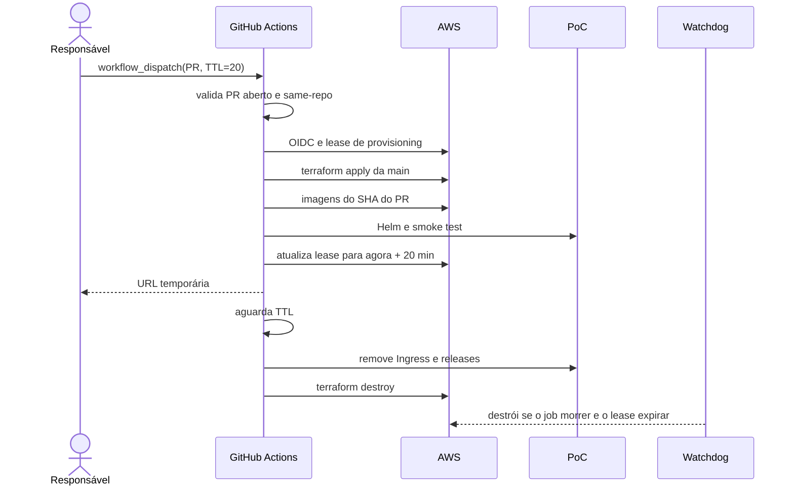

# ADR-0004 — PoC AWS efêmera, selecionada por PR e controlada por TTL

- **Status:** Aceito
- **Data:** 2026-08-07
- **Responsáveis:** projeto Operations Hub
- **Complementa:** ADR-0001
- **Substitui parcialmente:** ADR-0002 para o broker AWS e ADR-0003 para a role de automação
- **Substituído por:** —

## Contexto

O primeiro plano Terraform integrado criaria EKS 1.33, NAT Gateway, MSK Serverless, RDS e uma chave KMS gerenciada pelo cliente. Em 7 de agosto de 2026, essa composição não é compatível com uma conta Free Tier:

- EKS 1.33 já está em suporte estendido e custa mais que uma versão em suporte padrão;
- MSK Serverless possui cobrança-base por cluster-hora mesmo com baixo tráfego;
- NAT Gateway cobra por hora e por volume processado;
- uma chave KMS do cliente adiciona custo e ciclo de vida sem necessidade para a PoC;
- AWS Budgets alerta, mas não bloqueia nem encerra recursos.

O objetivo do portfólio continua sendo demonstrar React, NestJS, Spring Boot, PostgreSQL, Kafka, Kubernetes, Terraform, AWS e CI/CD em uma fatia vertical real. A otimização não pode remover Kafka nem voltar ao desenvolvimento de camadas isoladas.

Fontes consultadas:

- [preços e tiers de suporte do EKS](https://aws.amazon.com/eks/pricing/);
- [ciclo de versões do EKS](https://docs.aws.amazon.com/eks/latest/userguide/kubernetes-versions.html);
- [preços do Amazon MSK](https://aws.amazon.com/msk/pricing/);
- [criptografia padrão do EKS](https://docs.aws.amazon.com/eks/latest/userguide/envelope-encryption.html);
- [preços de NAT Gateway](https://docs.aws.amazon.com/vpc/latest/userguide/nat-gateway-pricing.html).

## Decisão

### Infraestrutura econômica

1. Usar EKS 1.36 enquanto estiver em suporte padrão.
2. Usar um único node group Spot `t3.medium`, com uma réplica desejada.
3. Executar os nodes em sub-redes públicas, com Security Groups restritivos, e não criar NAT Gateway.
4. Manter o RDS PostgreSQL privado em sub-redes de banco e `db.t4g.micro` Single-AZ.
5. Usar a criptografia de envelope padrão do EKS com chave pertencente à AWS; não criar CMK.
6. Executar `apache/kafka:4.3.1` em KRaft, uma réplica e `emptyDir`, dentro do EKS.
7. Manter MSK com autenticação IAM como evolução de produção, não como recurso desta PoC efêmera.
8. Definir orçamento mensal de USD 10 com e-mail de alerta configurável.

Kafka efêmero não oferece alta disponibilidade nem persistência após destruição. Isso é deliberado: o fluxo funcional, contratos, outbox e idempotência são demonstrados; durabilidade gerenciada é uma decisão de produção.

### Deploy explícito por PR

O workflow não responde ao evento `pull_request`. Ele só aceita `workflow_dispatch` na `main` e exige:

- número de um PR aberto;
- PR originado no próprio `WilliamRochaJR/operations-hub`, nunca de fork;
- TTL entre 5 e 60 minutos, com padrão de 20;
- GitHub Environment `poc` e OIDC;
- exclusão mútua pelo concurrency group `ephemeral-poc`.

A infraestrutura sempre vem do commit confiável da `main` que iniciou o workflow. Somente as imagens da aplicação são construídas a partir do SHA do PR escolhido. Isso impede que um PR altere o Terraform ou o próprio workflow que executa com a role AWS.

### Expiração e defesa em profundidade

A janela de 20 minutos começa somente depois do smoke test público. Provisionamento não consome a janela de demonstração.

Há três caminhos de remoção:

1. etapa `if: always()` no workflow principal;
2. workflow manual de cleanup com `force=true`;
3. watchdog agendado a cada 15 minutos, baseado em lease no bucket S3 do Terraform.

Durante provisioning, o lease recebe duas horas para acomodar EKS/RDS e eventual lentidão. Quando a aplicação fica saudável, a expiração passa a ser o TTL escolhido. O watchdog usa a revisão confiável da infraestrutura armazenada no lease.

O teardown remove primeiro Ingress e AWS Load Balancer Controller, para permitir a exclusão do ALB, e só depois executa `terraform destroy`. O bucket de state e o provider/role OIDC pertencem ao bootstrap e permanecem.

### Permissões da automação

A role continua sem `AdministratorAccess`. Para criar e destruir o ambiente completo ela recebe:

- `PowerUserAccess` para serviços não IAM;
- policy IAM adicional limitada a roles, instance profiles e policies com nomes do projeto;
- `iam:GetRole` limitado à service-linked role `AWSServiceRoleForAmazonEKSNodegroup`, necessária para validar a criação do node group;
- `iam:CreateServiceLinkedRole` limitado aos serviços usados;
- trust OIDC limitada ao repositório e ao environment `poc`.

Como a pipeline é a criadora do cluster e também precisa administrá-lo, sua role é registrada somente pela entrada EKS explícita `github_actions`. A opção automática `enable_cluster_creator_admin_permissions` permanece desabilitada para evitar duas access entries com o mesmo principal.

Esse escopo ainda é maior que o de uma pipeline que apenas publica imagens. Ele é aceito somente numa conta não produtiva, para um ambiente único e efêmero. Produção deve separar provisionamento e deploy em roles distintas, aplicar permission boundaries e exigir aprovação independente.

## Alternativas consideradas

### Manter MSK Serverless

Rejeitada para a PoC porque sua cobrança-base domina o custo mesmo sem tráfego. Continua recomendada como alternativa gerenciada para produção após dimensionamento.

### Manter NAT Gateway

Rejeitada para o ambiente temporário pelo custo fixo. Nodes públicos aumentam a superfície de rede, controlada por Security Groups e pela curta duração. Produção deve voltar a nodes privados.

### Criar o ambiente para todo PR

Rejeitada por custo, concorrência e risco de executar código não selecionado. O disparo manual e o número explícito do PR tornam a intenção auditável.

### Usar apenas o cleanup do mesmo job

Rejeitada como único controle: cancelamento do workflow ou indisponibilidade do runner pode impedir a etapa final. O lease e o watchdog fornecem recuperação independente.

### TTL de 20 minutos desde o início do job

Rejeitada porque EKS e RDS podem consumir quase toda a janela. O TTL começa após o sistema estar saudável.

## Consequências positivas

- Kafka e Kubernetes continuam reais na primeira fatia vertical;
- nenhum MSK, NAT Gateway ou CMK permanece cobrando;
- somente o PR escolhido é demonstrado;
- o ambiente é destruído automaticamente após a janela;
- state e identidade OIDC sobrevivem para novos ciclos;
- a infraestrutura executada vem sempre de uma revisão confiável da `main`.

## Consequências negativas e controles

| Consequência | Controle |
|---|---|
| EKS continua cobrado enquanto existe | TTL curto, watchdog e teardown manual |
| Node possui IPv4 público | sem portas inbound públicas no SG do node; ambiente temporário |
| Kafka perde dados no teardown/restart | comportamento esperado da PoC; Testcontainers cobre persistência funcional |
| Spot pode interromper o único node | aceitar nova execução; não é ambiente produtivo |
| Role CI possui PowerUser fora de IAM | conta não produtiva, OIDC restrito, environment e IAM nominalmente limitado |
| Cancelamento pode interromper cleanup | lease de provisioning e watchdog agendado |
| Schedule do GitHub pode atrasar | botão de cleanup forçado e verificação manual de recursos |

## Critérios de validação

- plano não contém MSK Serverless, NAT Gateway nem customer-managed KMS key;
- EKS usa versão em suporte padrão;
- Helm renderiza Kafka KRaft de uma réplica e workloads em plaintext interno;
- workflow rejeita fork, PR fechado, TTL inválido e execução fora da `main`;
- nenhuma execução ocorre automaticamente em `pull_request`;
- TTL é atualizado somente depois do smoke test;
- cleanup remove Helm/Ingress antes do Terraform;
- watchdog destrói lease expirado;
- plano de destruição não inclui bucket de state nem provider OIDC.

## Gatilhos para revisão

- ambiente passa a permanecer ativo continuamente;
- adoção de produção ou dados que não podem ser perdidos;
- necessidade de múltiplos PRs simultâneos;
- mudança de versão/preço do EKS;
- créditos Free Tier se aproximam do fim;
- exigência de nodes privados, MSK ou política IAM com privilégio mínimo por ação.
